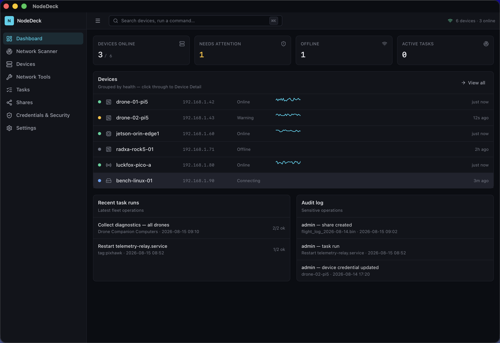
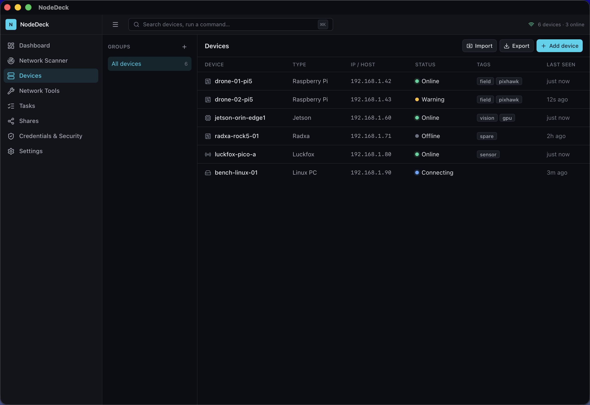
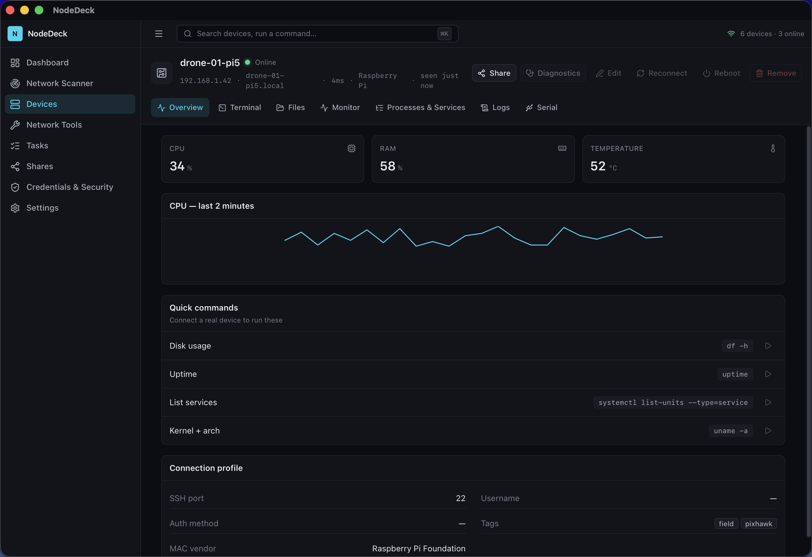
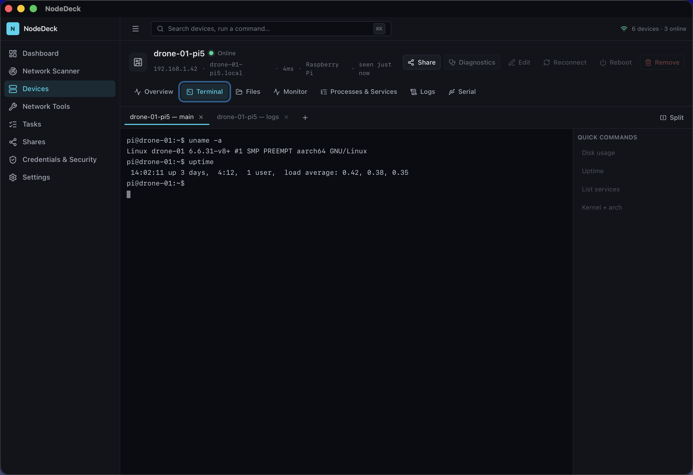
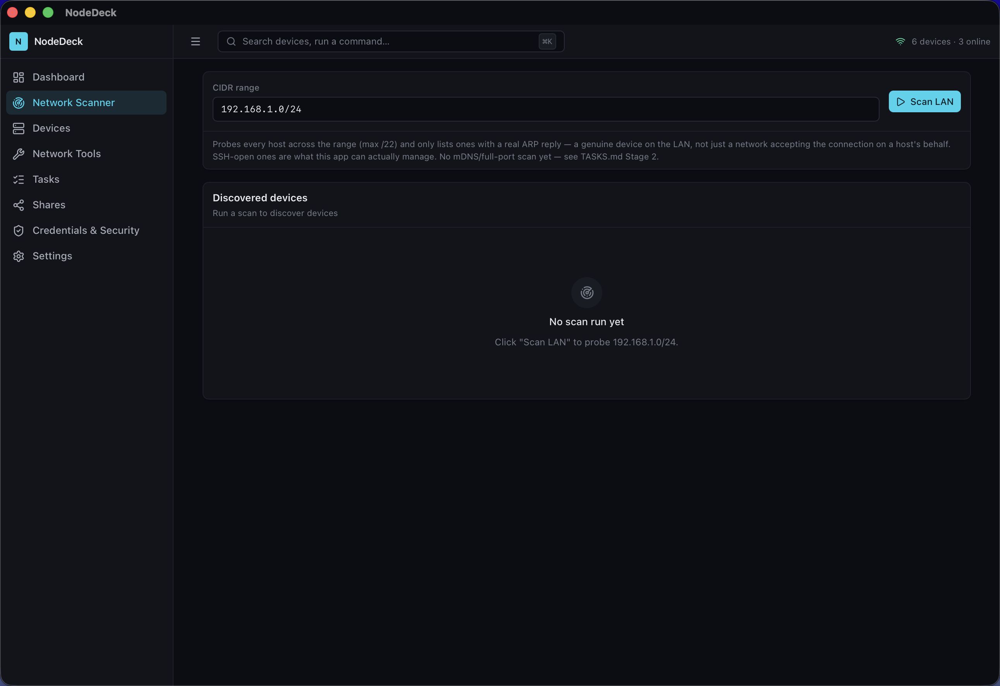
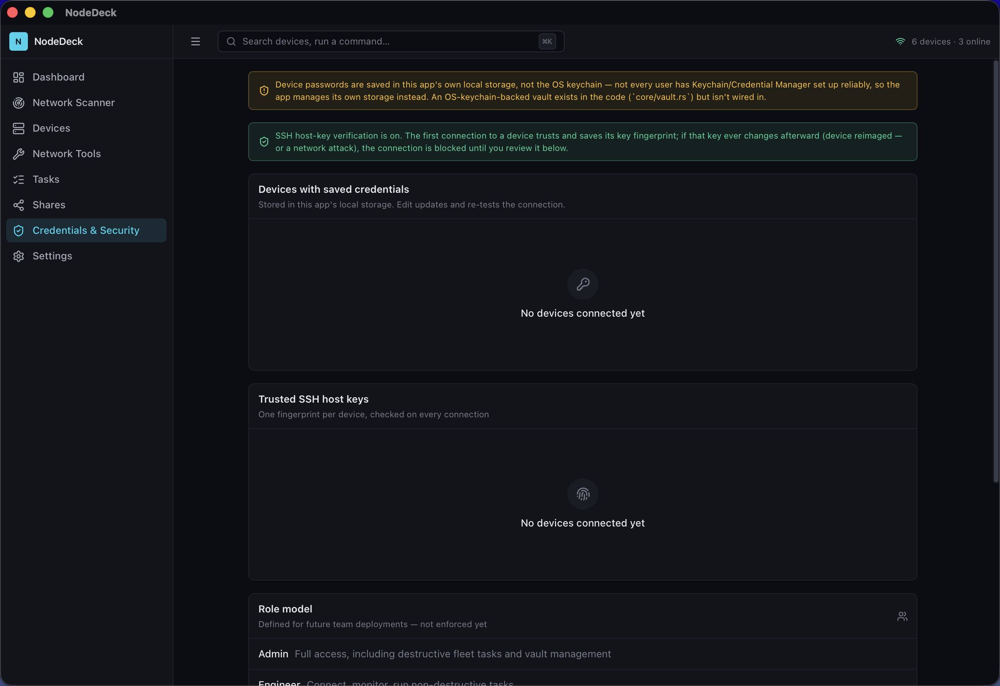

# NodeDeck

A cross-platform desktop app for managing fleets of Raspberry Pi–class **companion computers** — the onboard Linux boards on drones and robots that run your flight/vision/telemetry stack alongside the flight controller. Built with [Tauri](https://tauri.app/) (Rust) + React/TypeScript.

Discover devices on your network, connect over SSH, browse and transfer files, watch live system stats, tail logs, run fleet-wide tasks, and manage USB-serial consoles — all from one app, with everything stored locally on your machine.

**New here?** [USER_GUIDE.md](USER_GUIDE.md) walks through installing and using NodeDeck step by step, no prior experience assumed.

## Screenshots

| | |
|---|---|
|  |  |
| Dashboard — fleet health at a glance | Devices — inventory, status, tags |
|  |  |
| Live CPU/RAM/temp for a device | Real interactive SSH terminal |
|  |  |
| Network scanner — find real devices on your LAN | Credentials & Security — host-key trust, saved logins |

## Features

- **Network discovery** — scans your LAN for real devices (TCP probe + ARP cross-reference, not just a ping sweep), auto-detects your current CIDR
- **SSH terminal** — real interactive PTY sessions with quick-command shortcuts
- **SFTP file browser** — browse and transfer files between your machine and a device, with progress
- **Live system monitor** — CPU load, RAM, disk, temperature, uptime, polled continuously
- **Processes & services** — inspect and manage what's running on a device
- **Log tailing** — live `journalctl`/`dmesg` streaming over SSH
- **USB serial console** — talk to a board over serial with configurable baud/parity/flow control
- **Fleet task engine** — run a typed operation (run command, restart service, collect diagnostics, etc.) across many devices at once, with per-device status and retry
- **Device groups, bulk import/export, audit log**
- **Multi-user accounts** — separate local accounts, each with its own fully isolated device list and history
- **SSH host-key verification** (trust-on-first-use, like OpenSSH), and Touch ID unlock on macOS

Everything is local — no server, no account, no sync. Device credentials and inventory live in an embedded SQLite database in your OS's app-data directory; nothing leaves your machine except the SSH/SFTP traffic you initiate to your own devices.

## Status

This is an early-stage project, actively being built out. Not everything is finished or hardened yet — known gaps include device credentials not yet living in the OS keychain, Windows being largely untested, no code signing yet, and no automated frontend test suite. Contributions and bug reports very welcome.

## Getting started

See [USER_GUIDE.md](USER_GUIDE.md) for full install and first-use steps. Quick version for building from source:

Requirements: [Node.js](https://nodejs.org/) 20+, [Rust](https://rustup.rs/) (stable), and the platform prerequisites for [Tauri](https://tauri.app/start/prerequisites/).

```bash
npm install
npm run tauri dev     # run in development mode
npm run tauri build   # produce a release build for your platform
```

Windows and macOS builds are also produced by CI on push to `main` — see `.github/workflows/build.yml`.

## Tech stack

- **Frontend**: React, TypeScript, Tailwind CSS, Zustand
- **Backend**: Rust, Tauri 2, [`russh`](https://github.com/Eugeny/russh) (SSH/SFTP), `rusqlite` (embedded SQLite), `serialport`, `mdns-sd`

## Contributing

Issues and pull requests are welcome. The codebase is a fairly standard Tauri app — React/TypeScript in `src/`, Rust in `src-tauri/src/` (`core/` for the actual logic, `commands/` for the thin Tauri IPC layer). See [USER_GUIDE.md](USER_GUIDE.md#modifying-the-app) for how to make and test a change.

## License

MIT — see [LICENSE](LICENSE).
